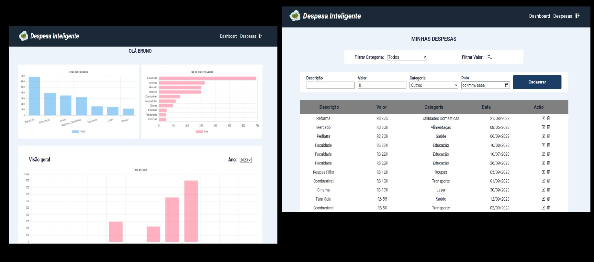

# 🏆 App Despesa Inteligente

## ✔️ Tecnologias Utilizadas

 

 

    <a href="https://app-gestao-de-gastos.vercel.app/" target="_blank">Visualize o projeto aqui</a>

 

## 📌 Resumo do Projeto
Este é o Sistema de Gestão de Despesas, uma solução robusta e intuitiva para o gerenciamento eficaz de suas finanças pessoais. Desenvolvido com a tecnologia React e styled-components, este sistema oferece uma interface amigável e dinâmica para o controle de suas despesas.

Os usuários podem criar uma conta utilizando um endereço de e-mail e senha, com a autenticação segura provida pelo Firebase. Uma vez cadastrados, os usuários têm acesso a um conjunto completo de ferramentas para gerenciar suas despesas.

Os dados das despesas são armazenados no Firestore, garantindo a segurança e a integridade das informações. Os usuários podem adicionar, editar e excluir registros de despesas de forma dinâmica, proporcionando flexibilidade e controle total sobre suas finanças.

> **OPCIONAL:** Se quiser utilizar um usuario de testes, já com dados cadastrados, utilize o login: bruno@email.com | senha: 123456

 

## 🛠️ Como executar o projeto
Para executar este projeto localmente em sua máquina, siga estas etapas:

- Certifique-se de ter o Node.js instalado em sua máquina.

- Clone este repositório em sua máquina local usando o comando ``git clone``.

- Instale as dependências do projeto executando ``npm install`` no diretório do projeto.

- Execute o comando ``npm start`` para rodar o projeto.

 

## ⭐ Desafio do Projeto
### Possuir uma tela de login
- Usuário deve inserir e-mail e senha
- Acessar a aplicação em caso de sucesso ou receber feedback de erro
- Usuários válidos podem estar engessados no código, sem problemas, o
importante aqui é o desenvolvimento da tela

### Possuir uma ou mais telas para listagem e cadastro dos gastos
- Apresentar listagem de todos os gastos cadastrados para o usuário
logado
- Registro de gastos deve possuir ao menos os seguintes campos: Valor,
Data, Descrição, Categoria
- Deve ser possível filtrar e ordenar os registros de gastos por categorias
e/ou valor
- Deve ser possível criar, editar e excluir registros de gastos do usuário
logado
- Número de telas, assim como fluxo de criação, atualização e leitura
dos registros são livres

### Possuir uma tela para resumo dos gastos cadastrados
- Deve apresentar ao usuário um resumo dos gastos cadastrados
- Formato livre, mas será levado em consideração na avaliação da tela:
- Apresentação - As informações apresentadas devem ser de fácil
entendimento e utilização
- Conteúdo - As informações apresentadas devem possuir alto valor
para o usuário

 

## 🙋🏻‍♂️ Autor

| [ Bruno Oliveira](https://github.com/BrunoOliveira16) |
| :---: |

